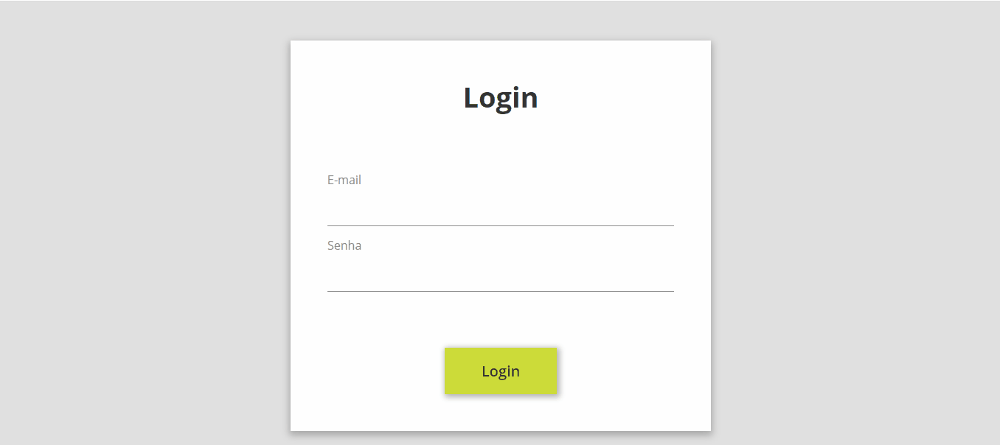

# Teste Front-end Mastertech
> Teste para ingressar como Front-end Developer na Mastertech

# Pré-requisitos
- React
- Functional components
- React router
- Hooks
- Redux (useContext)
- Consumo de APIs REST e protocolo HTTP
- JS (ES6+)
- Testes de snapshot com jest
- Html5, CSS3 e Sass
- Git
- node/npm


#### O que é permitido:
- ES6+
- Linters no geral tanto para JS como para CSS
- SASS
- React


#### O que não é permitido:
- Frameworks/Bibliotecas CSS (Bootstrap, Foundation, Materializecss e afins) . Você pode utilizar qualquer metodologia de arquitetura de código.
- Task runners como Webpack, Gulp, Grunt e afins.


O uso de ferramentas de teste é liberado (jest, jasmine, mocha, chai, sinon, supertest).

O objetivo desse teste é avaliar:
- organização;
- semântica;
- funcionamento e usabilidade
- uso e abuso das features das linguagens (React, CSS/SASS, JS);
- uso de patterns;
- performance do código;
- testes de JavaScript.


## Pronto para começar o teste?

- Faça um "fork" desse repositório na sua conta do Github
- Crie uma branch com o seu nome e sobrenome ex: `patrick-santos`
- Após completar o desafio, crie um "pull request" nesse repositório comparando a sua branch com a master
- Receberemos uma notificação do seu pull request, faremos a avaliação da sua solução e entraremos em contato.


# Teste
Crie as telas de login e de usuário que estão na pasta de imagens no arquivo de template, para fazer o login utilize 
a api http://jrwee.mocklab.io


#### Endpoint: POST /user/login
**Request Body**

 ``` json 
 {
    "email": "teste@front.com",
    "password": "teste123"
}
```

**Response 200**
```json
{
  "birthday": "1996-04-10",
  "email": "teste@front.com",
  "gender": "FEMALE",
  "id": 1,
  "name": "Grace Hopper",
  "state": "SP",
  "avatar": "https://upload.wikimedia.org/wikipedia/commons/thumb/a/ad/Commodore_Grace_M._Hopper%2C_USN_%28covered%29.jpg/1200px-Commodore_Grace_M._Hopper%2C_USN_%28covered%29.jpg"
}
```

**Response 404**
```
Request was not matched 
Neste caso considerar a resposta como 400 com o usuário enviando credenciais inválidas
```

Bom teste!
